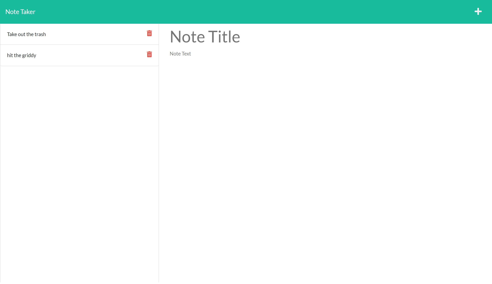

# Note Taker

## This application lets students take notes whenever they're struggling. Wish I had one

Provide a short description explaining the what, why, and how of your project. Use the following questions as a guide:

As a struggling student, I wanted to make an application that could easily help me with tasks that need to be done. My biggest takeaway from this was learning how routes worked and the file structure is very important to getting the app to work correctly.

## Credits

A big thank you to [https://github.com/Mateo-Wallace] for pointing me in the right direction. It took me forever to figure out why I couldn;t get my 'npm start' to work. 

## MIT License

Copyright (c) 2022 ProNevros

Permission is hereby granted, free of charge, to any person obtaining a copy
of this software and associated documentation files (the "Software"), to deal
in the Software without restriction, including without limitation the rights
to use, copy, modify, merge, publish, distribute, sublicense, and/or sell
copies of the Software, and to permit persons to whom the Software is
furnished to do so, subject to the following conditions:

The above copyright notice and this permission notice shall be included in all
copies or substantial portions of the Software.

THE SOFTWARE IS PROVIDED "AS IS", WITHOUT WARRANTY OF ANY KIND, EXPRESS OR
IMPLIED, INCLUDING BUT NOT LIMITED TO THE WARRANTIES OF MERCHANTABILITY,
FITNESS FOR A PARTICULAR PURPOSE AND NONINFRINGEMENT. IN NO EVENT SHALL THE
AUTHORS OR COPYRIGHT HOLDERS BE LIABLE FOR ANY CLAIM, DAMAGES OR OTHER
LIABILITY, WHETHER IN AN ACTION OF CONTRACT, TORT OR OTHERWISE, ARISING FROM,
OUT OF OR IN CONNECTION WITH THE SOFTWARE OR THE USE OR OTHER DEALINGS IN THE
SOFTWARE.